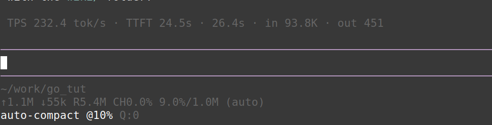

# pi-auto-compact



A [pi](https://github.com/earendil-works/pi-mono) extension that **automatically compacts the conversation context** when it reaches a configurable percentage of the context window **used** (default **80%**).

The limit can be set **globally** (all models) or **per model**, and a footer status bar shows the active limit.

## Features

- **Auto-compaction** fires when context **usage reaches your threshold** — keeps the context small and predictable.
- **Global or per-model limits:** set one default for everything, then override specific models by `provider/id` or bare `id`.
- **Live status bar:** `auto-compact @20% used` shows the active limit, updated every turn and on model change.
- **Easy commands** to view and change the limit on the fly.

## Install

As a package (from git or npm):

```bash
pi install git:github.com/loka1/pi-auto-compact
# or
pi install npm:@loka1/pi-auto-compact
```

Or drop the file at `~/.pi/agent/extensions/` (global) / `.pi/extensions/` (project-local) and `/reload`.

## Configuration

Config is merged from JSON files (project wins over global), or set interactively:

| File | Scope |
|------|-------|
| `~/.pi/agent/auto-compact.json` | Global |
| `.pi/auto-compact.json` | Project-local (wins) |

```json
{
  "enabled": true,
  "compactAtPercent": 20,
  "cooldownTurns": 1,
  "models": {
    "deepseek/deepseek-v4-pro": 15,
    "gpt-4o": 25
  }
}
```

- `compactAtPercent` — **global** default: **compact when this % of the context window is used** (20 = compact when 20% used; higher = wait longer, lower = compact sooner).
- `models` — **per-model** overrides (win over global). Key by `"provider/id"` or bare `"id"`.
- `cooldownTurns` — minimum turns between automatic compactions.

## Commands

```
/autocompact                            → show config + effective limit for current model
/autocompact set <percent>              → set the GLOBAL limit (compact when this % used)
/autocompact model <id> <percent>       → set a PER-MODEL limit (overrides global)
/autocompact unset <id>                 → remove a per-model override
/autocompact toggle                     → enable/disable auto-compaction

# Quick one-command aliases (value = % of context USED at which to compact):
/set-auto-compact-limit 20                     → compact at 20% used (global)
/set-auto-compact-limit 10 model gpt-4o        → compact at 10% used for "gpt-4o"
```

Per-model limits **always win** over the global one. Use the `provider/id` or bare
`id` of the model, e.g. `inferx/deepseek-v4-flash-0731`, `deepseek/deepseek-v4-pro`,
or just `gpt-4o`. To make a model follow the global limit instead, remove its
override with `/autocompact unset <id>`.

All changes are saved to the config file and take effect immediately (no reload
needed); the footer status bar shows the active limit, e.g. ``auto-compact @20% used``.

## License

MIT
